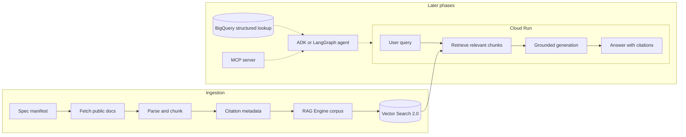

# Telco Spec Assistant

> A grounded RAG assistant over public 5G, O-RAN, and 3GPP specifications, built as a production-shaped cloud application.


Ask natural-language questions about telecom standards and get grounded, cited answers instead of plausible guesses. Each answer should point back to the exact specification, release, version, and clause that supports it.

## Why this exists

Telecom standards are precise, versioned, and full of details that general LLMs often get wrong. This project starts with 3GPP TS 38.322, the NR Radio Link Control protocol specification, and builds a small but credible retrieval system that answers from source material with traceable citations.

The first release is intentionally small: one seed corpus, clause-aware chunking, vector retrieval, cited answers, and a retrieval-focused evaluation set. The broader architecture documents how the same system can grow into a deployed GenAI application with structured lookup, agent tools, MCP, observability, and domain-specific integrations.

## V1 Scope

V1 builds the spec-RAG path only:

- Fetch public specifications from a manifest.
- Parse and chunk documents with citation metadata.
- Index chunks in Google Cloud RAG Engine backed by Vector Search 2.0.
- Serve a Cloud Run API that returns grounded answers with citations.
- Evaluate retrieval and grounded answer quality on about 20 RLC questions.

Structured lookup, agent routing, MCP, and deep production observability are documented as later phases, not part of the first executable cut.

## Architecture



See [docs/architecture.md](docs/architecture.md) for the full system plan and [docs/mvp-scope.md](docs/mvp-scope.md) for the build boundary.

## Citation Metadata

Every indexed chunk carries source metadata as first-class data:

| Field | Example | Purpose |
|---|---|---|
| `spec_id` | `3GPP TS 38.322` | Which standard the chunk came from |
| `release` | `Rel-19` | The 3GPP release |
| `version` | `v19.2.0` | Exact document version when known |
| `section` | `5.2.1` | Clause or section identifier |
| `page` | `12` | Source page when available |
| `source_url` | `https://www.3gpp.org/...` | Official source URL |
| `chunk_hash` | `sha256:...` | Content fingerprint |
| `doc_title` | `NR; Radio Link Control (RLC) protocol specification` | Human-readable label |

## Repository Structure

```text
telco-spec-assistant/
├── infra/                 # Terraform for Google Cloud resources
├── scripts/               # Fetch and utility scripts
├── ingestion/             # Parse, chunk, metadata, and index import logic
├── serving/               # Cloud Run API
├── eval/                  # Retrieval and groundedness evaluation
├── specs/                 # Public manifest files, not downloaded specs
├── docs/                  # Architecture and scope notes
├── structured/            # Later: BigQuery lookup data and loaders
├── agent/                 # Later: ADK or LangGraph routing
├── mcp/                   # Later: MCP server
├── .env.example
├── .gitignore
├── LICENSE
└── README.md
```

## Quickstart

The implementation is scaffolded but not complete yet.

Expected local flow:

```bash
cp .env.example .env
python scripts/fetch_specs.py --manifest specs/manifest.example.yaml
python -m ingestion.run --manifest specs/manifest.example.yaml
python -m serving.app
python -m eval.run --dataset eval/datasets/rlc_retrieval_v1.jsonl
```

Expected deployment target:

```bash
cd infra
terraform init
terraform apply
gcloud run deploy telco-spec-assistant --source ../serving --region us-central1
```

## Evaluation

V1 evaluation focuses on retrieval over the RLC specification:

| Metric | Target |
|---|---|
| Retrieval recall@5 | Answer-supporting chunk appears in top 5 |
| Citation precision | Cited clause supports the generated claim |
| Groundedness | Answer avoids unsupported claims |
| Latency p50 / p95 | Measured end to end |
| Cost per request | Estimated from model and retrieval calls |

The initial dataset lives at [eval/datasets/rlc_retrieval_v1.jsonl](eval/datasets/rlc_retrieval_v1.jsonl).

## Roadmap

- [ ] Phase 1: Spec RAG over 3GPP TS 38.322 with cited answers and retrieval eval.
- [ ] Phase 2: Expand corpus to a small multi-spec telecom set.
- [ ] Phase 3: Add BigQuery structured lookup for exact parameter questions.
- [ ] Phase 4: Add ADK or LangGraph tool routing.
- [ ] Phase 5: Expose the tools through an MCP server.
- [ ] Phase 6: Add production observability, tracing, and cost reporting.

## Security and Data

- Do not commit secrets, `.env` files, service account keys, or credential JSON.
- Do not commit downloaded 3GPP, O-RAN, or other standards documents.
- Fetch public source documents at build time from official URLs.
- Keep local development corpora under ignored data directories.
- Use least-privilege service accounts for deployed resources.

## License

Apache-2.0. See [LICENSE](LICENSE).
