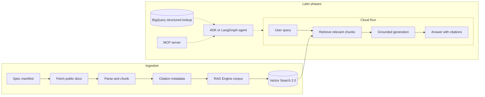

# Telco Spec Assistant

> A grounded RAG assistant over public 5G, O-RAN, and 3GPP specifications, built on Google Cloud's Gemini Enterprise Agent Platform.


[](https://github.com/mlguyYT/Telco-Spec-Assistant/actions/workflows/ci.yml)

Ask natural-language questions about telecom standards and get grounded, cited answers instead of plausible guesses. Each answer should point back to the exact specification, release, version, and clause that supports it.

## Why this exists

Telecom standards are precise, versioned, and full of details that general LLMs often get wrong. This project starts with 3GPP TS 38.321, TS 38.322, and TS 38.331, covering NR MAC, RLC, and RRC protocol specifications, and builds a small but credible retrieval system that answers from source material with traceable citations.

The first release is intentionally small: a focused seed corpus, clause-aware chunking, local retrieval, cited answers, and a retrieval-focused evaluation set. The broader architecture documents how the same system can grow into a deployed GenAI application with managed vector retrieval, structured lookup, agent tools, MCP, observability, and domain-specific integrations.

## V1 Scope

V1 builds the spec-RAG path only:

- Fetch public specifications from a manifest.
- Parse and chunk documents with citation metadata.
- Run a local BM25 baseline and optionally compare it with Vertex AI Vector Search.
- Serve an API that returns conservative extractive answers by default, with optional Gemini grounded generation.
- Evaluate retrieval, paraphrase robustness, abstention, and answer assertion quality on a MAC/RLC/RRC-focused question set.

Structured lookup, agent routing, MCP, and deep production observability are documented as later phases, not part of the first executable cut.

## Architecture



See [docs/architecture.md](docs/architecture.md) for the full system plan and [docs/mvp-scope.md](docs/mvp-scope.md) for the build boundary.

## Citation Metadata

Every indexed chunk carries source metadata as first-class data:

| Field | Example | Purpose |
|---|---|---|
| `spec_id` | `3GPP TS 38.322` | Which standard the chunk came from |
| `release` | `Rel-19` | The 3GPP release |
| `version` | `v19.2.0` | Exact document version when known |
| `section` | `5.2.1` | Clause or section identifier |
| `page` | `12` | Source page when available |
| `source_url` | `https://www.3gpp.org/...` | Official source URL |
| `chunk_hash` | `sha256:...` | Content fingerprint |
| `doc_title` | `NR; Radio Link Control (RLC) protocol specification` | Human-readable label |

## Repository Structure

```text
telco-spec-assistant/
├── infra/                 # Terraform for Google Cloud resources
├── scripts/               # Fetch and utility scripts
├── ingestion/             # Parse, chunk, metadata, and index import logic
├── serving/               # Cloud Run API
├── eval/                  # Retrieval and groundedness evaluation
├── specs/                 # Public manifest files, not downloaded specs
├── docs/                  # Architecture and scope notes
├── structured/            # Later: BigQuery lookup data and loaders
├── agent/                 # Later: ADK or LangGraph routing
├── mcp/                   # Later: MCP server
├── .env.example
├── .gitignore
├── LICENSE
└── README.md
```

## Local Phase 1 Quickstart

Phase 1 runs locally before any cloud resources are required. It stages the MAC, RLC, and RRC seed documents into an ignored data directory, extracts clauses, writes citation chunks, and evaluates retrieval.

Setup:

```bash
python3 -m venv .venv
. .venv/bin/activate
pip install -r requirements.txt
```

Run with an existing local seed document:

```bash
python scripts/run_phase1_local.py \
  --seed-dir ../input/3gpp-documents \
  --no-download
```

Or fetch from the official manifest URL:

```bash
python scripts/run_phase1_local.py
```

Generated files are written under `.data/`, which is ignored by git.

Run the local API after the Phase 1 pipeline:

```bash
python -m serving.app --chunks .data/chunks/telco_v1.jsonl
curl -X POST http://127.0.0.1:8080/ask \
  -H 'content-type: application/json' \
  -d '{"q":"What are the three RLC modes?"}'
```

Smoke-test the deployable API container against the generated chunks:

```bash
docker build -t telco-spec-assistant .
docker run --rm -p 8080:8080 \
  -v "$PWD/.data/chunks:/data/chunks:ro" \
  telco-spec-assistant
```

## Current Local Evaluation

V1 evaluation focuses on retrieval and abstention over the MAC, RLC, and RRC specifications:

| Metric | Target |
|---|---|
| Answerable recall@5 | Answer-supporting clause appears in top 5 |
| Per-spec recall@5 | Same metric split by source specification |
| Paraphrase recall@5 | Same metric on deliberately hard wording variants |
| Abstention accuracy | Out-of-scope questions return no evidence |
| Answer citation accuracy | Generated citations include an expected supporting clause |
| Answer refusal accuracy | Out-of-scope questions produce an unsupported/refusal answer |
| Answer quality | Required assertion terms appear in grounded extractive answers |
| Assertion group accuracy | Required answer-term groups matched across labeled questions |
| Latency p50 / p95 | Measured end to end |
| Cost per request | Estimated from model and retrieval calls |

Current local baseline after the multi-spec corpus expansion:

| Metric | Value |
|---|---:|
| Questions | 176 |
| Answerable questions | 169 |
| Out-of-scope questions | 7 |
| Overall recall@5 | 0.824 |
| Answerable recall@5 | 0.817 |
| MAC recall@5 | 0.900 |
| RLC recall@5 | 0.872 |
| RRC recall@5 | 0.714 |
| Non-paraphrase recall@5 | 0.861 |
| Paraphrase recall@5 | 0.273 |
| Abstention accuracy | 1.000 |
| Answer-quality questions | 25 |
| Answer quality accuracy | 0.320 |
| Answer assertion group accuracy | 0.506 |
| Answer citation accuracy | 0.817 |
| Answer refusal accuracy | 1.000 |
| Latency p50 / p95 | ~32 ms / ~40 ms |

The larger benchmark intentionally includes exact clause lookups, smoke retrieval rows, same-section-number disambiguation, paraphrases, and out-of-scope controls. The local BM25 baseline is still strong on many exact MAC/RLC questions, but the RRC and paraphrase gaps make the optional managed vector and hybrid retrieval comparison meaningful.

The multi-spec dataset lives at [eval/datasets/telco_retrieval_v1.jsonl](eval/datasets/telco_retrieval_v1.jsonl). The original RLC-only dataset remains at [eval/datasets/rlc_retrieval_v1.jsonl](eval/datasets/rlc_retrieval_v1.jsonl).

See [docs/retrieval-results.md](docs/retrieval-results.md) for BM25, Vertex AI Vector Search, and hybrid retrieval comparisons.

## Grounded Generation

The serving layer has a pluggable answer generator:

- `GENERATOR=extractive` keeps the default local path credential-free and quotes evidence from retrieved chunks.
- `GENERATOR=gemini` uses Vertex AI Gemini generation over the retrieved chunks and requires `GCP_PROJECT_ID`, `REGION`, and `GEMINI_MODEL`.

The Gemini path is constrained to the retrieved excerpts. It must return structured JSON, cite only retrieved chunk IDs, and refuse when the retrieved evidence is insufficient.

## Deployment Target

Cloud deployment is Phase 2. The checked-in Dockerfile is the local Cloud Run-compatible serving shape; it expects chunk data to be supplied at runtime and does not bake downloaded specifications or generated chunks into the image. Optional Vertex AI Vector Search scripts let the same clause chunks be embedded, indexed, compared against BM25, and torn down after testing.

For a limited expert review pilot, see [docs/expert-access.md](docs/expert-access.md) and [docs/expert-review-runbook.md](docs/expert-review-runbook.md). The recommended access model is an identity-aware access layer in front of the browser UI, not a public unauthenticated endpoint.

## Roadmap

- [ ] Phase 1: Spec RAG over 3GPP TS 38.321, TS 38.322, and TS 38.331 with cited answers and retrieval eval.
- [ ] Phase 2: Add optional Vertex AI Vector Search retrieval and compare recall against BM25.
- [ ] Phase 3: Add BigQuery structured lookup for exact parameter questions.
- [ ] Phase 4: Add ADK or LangGraph tool routing.
- [ ] Phase 5: Expose the tools through an MCP server.
- [ ] Phase 6: Add production observability, tracing, and cost reporting.

## Security and Data

- Do not commit secrets, `.env` files, service account keys, or credential JSON.
- Do not commit downloaded 3GPP, O-RAN, or other standards documents.
- Fetch public source documents at build time from official URLs.
- Keep local development corpora under ignored data directories.
- Use least-privilege service accounts for deployed resources.

## License

Apache-2.0. See [LICENSE](LICENSE).
